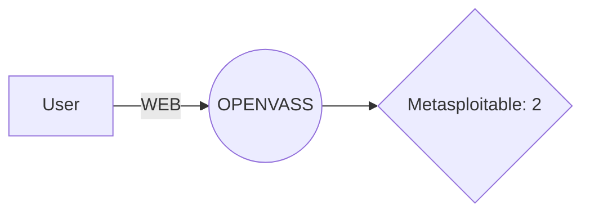

# OPENVAS
Repositorio dedicado a una instalacion basica y uso adecuado de OPENVASS 

# Instalacion 
OpenVas ofrece multiples productos relacionados el escaneo de vulnerabilidades, pero en este caso solo suaremos la version free.

Esta misma puede ser descargada en el siguiente enlace https://www.greenbone.net/en/openvas-free/

Asi mismo en la pagina se puede encontrar el turorial de su instalacion

Se accede al Wizard

Se crea el ussuario para la interfaz grafica y ya dependiendo de si se tiene o no una key de los otros productos se deja o se inserta esta misma key.

Ya finalmente de la instalacion podremos observarn la ip del dispositivo donde estara nuestra web interface

# Uso

Ya con la inferza instalada, iniciamos sesion con el usuario antes creado y tendremos la siguiente interfaz

## Escaneo basico
Openvas nos da la capacidad de hacer escaneos a multiples ips o host individuales

Para ello iremos a la ventana de Configuration -> Targets, donde podremos anadir nuestros targets.

En este caso estamos usando la maquina de Metaesploitable2 que se puede encontrar en https://www.vulnhub.com/entry/metasploitable-2,29/

Una configuracion basica es la siguiente

Asi mismo hay configuraciones adicionales tales como

Esto con el fin si somos administradores poder ir a mas profunidad, en este caso con el proposito de la herramienta, nos limitaremos a solo hacer analisis desde la ip objetivo.

# Resultados

# Metodologia 
