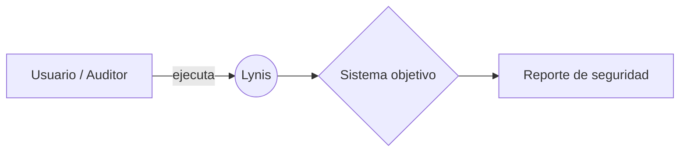

# Lynis – Guía de Auditoría de Seguridad



Repositorio dedicado a una guía completa de instalación, uso y mejores prácticas de **Lynis**, la herramienta open-source de auditoría de seguridad para sistemas UNIX.

---

## Tabla de contenidos

| Sección | Descripción |
|---|---|
| [Introducción](introduction.md) | Objetivos del proyecto, audiencia y casos de uso |
| [Sistemas operativos soportados](supported-os.md) | Plataformas compatibles con Lynis |
| [Cómo funciona](how-it-works.md) | Metodología de escaneo y pasos de auditoría |
| [Instalación](installation.md) | Cómo instalar Lynis en distintos sistemas |
| [Uso](usage.md) | Cómo ejecutar Lynis y entender sus resultados |

---

## ¿Qué es Lynis?

**Lynis** es una herramienta de auditoría de seguridad open-source diseñada para sistemas UNIX y Linux. Realiza escaneos exhaustivos del sistema para detectar vulnerabilidades, configuraciones incorrectas y oportunidades de hardening.

### Características principales

- **Sin dependencias externas** – Lynis utiliza únicamente las herramientas disponibles en el sistema.
- **Escaneo modular y oportunista** – Solo evalúa los componentes que encuentra instalados.
- **Multiplataforma** – Compatible con Linux, macOS, BSD, Solaris y muchos más.
- **Reportes detallados** – Genera reportes con sugerencias concretas de mejora.

### Casos de uso típicos

- Auditoría de seguridad
- Pruebas de cumplimiento (PCI, HIPAA, SOX)
- Pruebas de penetración
- Detección de vulnerabilidades
- Hardening de sistemas

---

## Inicio rápido

```bash
# Clonar el repositorio oficial
git clone https://github.com/CISOfy/lynis

# Entrar al directorio
cd lynis

# Ejecutar una auditoría del sistema
sudo ./lynis audit system
```

Para instrucciones detalladas, consulta la sección de [Instalación](installation.md) y [Uso](usage.md).

---

## Recursos oficiales

- Sitio web: https://cisofy.com/lynis/
- Repositorio GitHub: https://github.com/CISOfy/lynis
- Documentación: https://cisofy.com/documentation/lynis/

