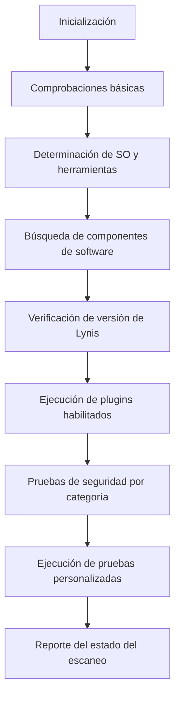

# Cómo funciona Lynis

## Metodología de escaneo

El escaneo de Lynis es **modular y oportunista**. Esto significa que Lynis solo utilizará y probará los componentes que pueda encontrar en el sistema, tales como las herramientas disponibles y sus bibliotecas.

El beneficio de este enfoque es que **no se necesita instalar herramientas adicionales**, lo que permite mantener los sistemas limpios y con una superficie de ataque mínima.

```
┌─────────────────────────────────────────────────────┐
│                    Sistema objetivo                  │
│                                                     │
│  ┌──────────┐  ┌──────────┐  ┌──────────────────┐  │
│  │  Apache  │  │  MySQL   │  │  OpenSSH / SSL   │  │
│  └────┬─────┘  └────┬─────┘  └────────┬─────────┘  │
│       │              │                  │            │
│  ┌────▼──────────────▼──────────────────▼─────────┐ │
│  │               Lynis (escaneo)                  │ │
│  └────────────────────────────────────────────────┘ │
└─────────────────────────────────────────────────────┘
                         │
                         ▼
              ┌──────────────────────┐
              │  Reporte de auditoría │
              └──────────────────────┘
```

Gracias a este método, la herramienta puede ejecutarse **casi sin dependencias**. Además, cuantos más componentes descubra, más exhaustiva será la auditoría. En otras palabras: **Lynis siempre realizará escaneos adaptados a tu sistema. ¡Ninguna auditoría será igual a otra!**

### Ejemplo de escaneo adaptativo

Cuando Lynis detecta que tienes Apache instalado, realiza una ronda inicial de pruebas relacionadas con Apache. Luego, durante las pruebas específicas de Apache, puede descubrir también una configuración SSL/TLS, lo que activa pasos adicionales de auditoría basados en ese hallazgo. Un buen ejemplo es la recolección de certificados descubiertos para que puedan ser analizados posteriormente.

---

## Pasos de auditoría

Esto es lo que sucede durante un escaneo típico con Lynis:



### 1. Inicialización

Lynis carga su configuración, verifica la integridad de sus propios archivos y prepara el entorno de ejecución. Se establecen variables de entorno y se configuran rutas de trabajo.

### 2. Comprobaciones básicas

Se realizan verificaciones fundamentales como:
- Propiedad y permisos de los archivos de Lynis
- Comprobación del usuario con el que se ejecuta (root vs. usuario normal)
- Verificación del entorno de ejecución (shell, sistema de archivos)

### 3. Determinación del SO y herramientas disponibles

Lynis identifica:
- El sistema operativo y su versión
- El gestor de paquetes disponible (apt, yum, brew, pkg, etc.)
- Las herramientas de línea de comandos presentes en el sistema

### 4. Búsqueda de componentes de software

Se detectan los servicios y aplicaciones instaladas:
- Servidores web (Apache, Nginx, etc.)
- Bases de datos (MySQL, PostgreSQL, MongoDB, etc.)
- Servicios de red (SSH, FTP, DNS, etc.)
- Aplicaciones de seguridad (firewalls, IDS/IPS, antivirus)

### 5. Verificación de versión de Lynis

Lynis comprueba si hay una versión más reciente disponible para garantizar que se están aplicando las pruebas de seguridad más actualizadas.

### 6. Ejecución de plugins habilitados

Los plugins extienden las capacidades de Lynis con pruebas adicionales especializadas. Pueden incluir pruebas de cumplimiento para estándares como PCI-DSS, HIPAA o CIS Benchmarks.

### 7. Pruebas de seguridad por categoría

Las pruebas se organizan en categorías, entre ellas:

| Categoría | Ejemplos de pruebas |
|---|---|
| **Sistema de archivos** | Permisos, directorios temporales, atributos |
| **Usuarios y grupos** | Cuentas sin contraseña, grupos privilegiados |
| **Autenticación** | Políticas de contraseñas, PAM, sudo |
| **Red** | Puertos abiertos, interfaces, firewall |
| **Servicios** | SSH, cron, inetd, servicios activos |
| **Software** | Actualizaciones pendientes, software inseguro |
| **Kernel** | Parámetros sysctl, módulos cargados |
| **Logging** | Configuración de syslog, rotación de logs |
| **Criptografía** | Certificados SSL/TLS, algoritmos usados |
| **Memoria y procesos** | Procesos zombies, uso de memoria |

### 8. Ejecución de pruebas personalizadas (opcional)

Lynis permite agregar pruebas personalizadas adaptadas a las necesidades específicas de tu organización o entorno.

### 9. Reporte del estado del escaneo

Al finalizar, Lynis genera:
- Un **resumen en pantalla** con los hallazgos más importantes
- Un **archivo de log** detallado (`/var/log/lynis.log`)
- Un **archivo de reporte** con datos estructurados (`/var/log/lynis-report.dat`)
- Un **índice de hardening** (puntuación de seguridad del sistema)

---

## Índice de hardening

Al final de cada escaneo, Lynis calcula un **Hardening Index** (índice de hardening), una puntuación que refleja el estado general de seguridad del sistema en una escala de 0 a 100.

```
  Hardening index : [65]          [#############       ]
```

Este índice sirve como métrica para:
- Comparar el estado de seguridad entre diferentes sistemas
- Medir el progreso después de aplicar mejoras
- Establecer líneas base de seguridad en la organización

---

Continúa con:
- [Instalación](installation.md)
- [Uso](usage.md)
